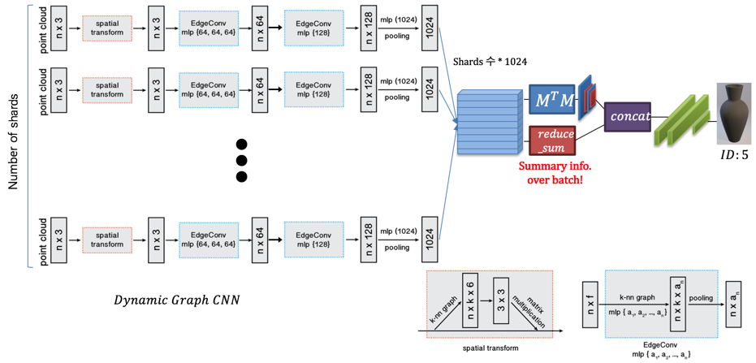

# IN PROGRESS

## AIRI_Pottery
3D classification and segmentation of points cloud data
* Each pottery(label) has various size of shards.  
* Each Shards has various size of points.  

## Classficiation Model

## DATA PREPARING
run make_filelist.ipynb ### 도자기 별 shards list  
~~run npytoh5.ipynb ### 도자기 별 shards' points data 생성 및 train/test files list 생성~~  
run npytoh5_seglabel.ipynb ### 도자기 별 shards' *CENTRALIZED(italic)* point cloud data, lables, segmentation_label 생성  
* max segmentation part = 4  
    * segmentation 수가 모자를 경우, 남은 label = 0으로 dummy처리 ( ex> [0,1,1] -> [0,1,1,0] )

## Acknowledgement
This code is heavily borrowed from [dgcnn](https://github.com/WangYueFt/dgcnn), and [pointnet](https://github.com/charlesq34/pointnet)

