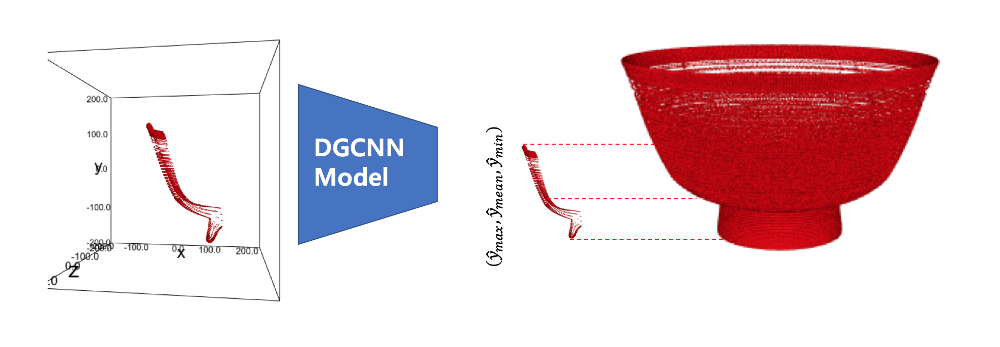

# IN PROGRESS

## AIRI_Pottery
3D classification and segmentation (location prediction) of points cloud data
* Each pottery(label) has various size of shards.  
* Each Shards has various size of points.  

---

## DATA PREPARING
1. run make_filelist.ipynb ### 도자기 별 shards list  
2. run npytoh5_seglabel.ipynb ### 도자기 별 shards' *CENTRALIZED* point cloud data, pottery labels(ID), segmentation_label 생성
   * segmentation_label: 각 shard의 (y_max, y_mean, y_min) 을 label로 부여

---

## Model


  
- train: ./train_pottery_combined.py  
- model: ./models/dgcnn+skipdense.py   

```bash
python train_pottery_combined.py
```

---

## RESULT FIGURE (ex)
#### 1. classification  


#### 2. location prediction  


---

## EXPERIMENT
- 실험 환경: ubuntu 16.04, 64Gmemory, 16core, GPU Tesla V100-SXM2(16G) * 2 (used 1 GPU)  
- Tensorflow
 
---

## VISUALIZATION
./pottery_demo.ipynb

---

## Acknowledgement
This code is heavily borrowed from [dgcnn](https://github.com/WangYueFt/dgcnn), and [pointnet](https://github.com/charlesq34/pointnet)

